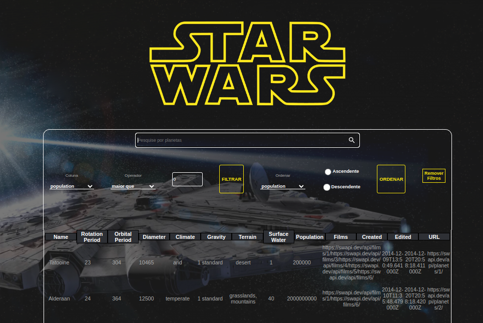

## 🧐 Sobre

<p align="left"> 
	StarWars Planets Search é uma lista de filtros de planetas do universo Star Wars usando Context API e Hooks para controlar estados globais. Esta aplicação é capaz de:

- adicionar e remover filtros;
- acumular filtros;
</p>

<div align="center" display="inline">

</div>


## ⚒ Instalando <a name = "installing"></a>

```bash
# Clone o projeto
$ git clone git@github.com:wesleymktd/project-starwars-planets-search.git
# Acesse
$ cd ./project-starwars-planets-search
# Instale as dependencias
$ npm install
# Inicie o projeto
$ npm start
# O servidor vai inicar na porta <http://localhost:3000>
```

## Principais tecnologias utilizadas:
- React;
- Hooks;
- Context API;
- JavaScript;
- Css;

